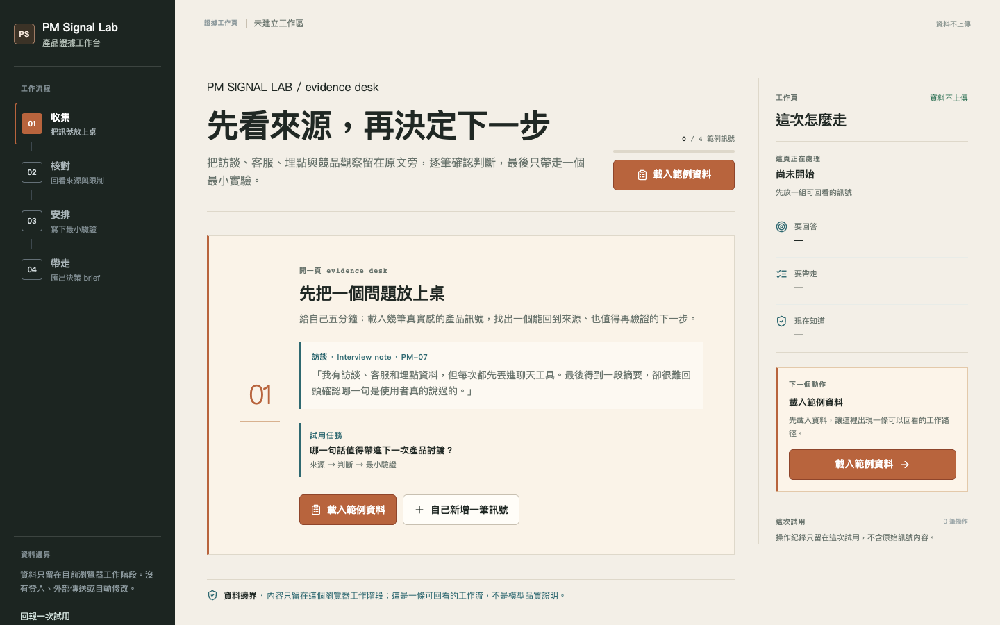

# PM Signal Lab

> 把產品訊號變成有來源、可審核的下一步。

PM Signal Lab 是一個 local-first product evidence workbench。它把訪談、客服、產品觀察與競品片段串成一條可回看的工作流：

`Collect → Verify → Decide → Ship`

Hosted demo：<https://asdc163.github.io/pm-signal-lab/>



這個專案不是泛用聊天機器人，也不把規則輸出包裝成模型能力。v0 先用固定規則完成一條可重跑、可檢查、沒有 API key 的產品工作流，讓 PM 練習 evidence、claim、uncertainty、experiment 與 decision memo 之間的關係。

這是 [John Wu](https://github.com/asdc163) 的 AI Product Manager portfolio project：重點不在「AI 看起來很會」，而在於能不能把訊號、來源、限制與下一步連成一個可被團隊使用的產品流程。

## 為什麼現在做

工具的門檻正在下降，但 PM 最難的部分仍然是：哪些訊號值得相信、結論能不能回到來源、缺口要如何轉成最小實驗。PM Signal Lab 以這個信任問題為產品核心，讓系統整理候選內容，但把判斷責任留在人身上。

本專案的方向建立在 2026-08-14 對 1,042 個公開 GitHub reference repos 的 metadata、README 結構與 20 個近鄰案例研究上。完整研究方法與證據邊界在 [`docs/research/github-reference-research-2026-08-14.md`](./docs/research/github-reference-research-2026-08-14.md)。這是 reference corpus，不是採用率或成功保證。

## 目前可以做什麼

- 載入一組含訪談、客服、產品觀察與競品訊號的 sample evidence pack。
- 新增一筆本機 evidence；表單會保留錯誤輸入並標出來源、內容與長度問題。
- 逐個查看 candidate claim 的 source mapping、timestamp 與 limitation。
- `接受`、`編輯`、`保留為假設` 或標記缺少證據；只有人為處理過的 claim 才能進入決策 brief。
- 草擬可編輯的 experiment brief，包含 primary metric、guardrail、smallest test 與 decision rule。
- 匯出、複製或下載帶有 `Not covered` 的 Markdown decision memo。

所有內容目前只存在於瀏覽器 session。沒有登入、資料庫、外部 AI provider、GitHub mutation、MCP action、telemetry 或自動發送。

## Quickstart

需要 Node.js 20.19+ 與 npm。

```bash
npm install
npm run dev
```

開啟 Vite 顯示的 local URL，按下 `載入範例資料`，再依序完成 Verify、Decide 與 Ship。

在提交前執行完整本機 gate：

```bash
npm test
npm run lint
npm run build
```

## 產品與工程設計

核心 domain object 是：

`Evidence → Claim → ExperimentBrief → DecisionMemo`

UI 與 domain engine 分開，便於日後加入 provider adapter，而不把 API key、模型漂移或外部 side effect 帶進第一版。主要檔案：

- [`src/App.tsx`](./src/App.tsx)：工作流程、狀態與互動組合。
- [`src/domain/synthesis.ts`](./src/domain/synthesis.ts)：deterministic candidate claims 與 experiment draft。
- [`src/domain/export.ts`](./src/domain/export.ts)：decision memo readiness gate 與 Markdown export。
- [`src/domain/fixture.ts`](./src/domain/fixture.ts)：可重跑的 product discovery sample pack。
- [`src/styles.css`](./src/styles.css)：deep-green shell、warm-paper workbench、evidence spine 與 responsive layout。
- [`.github/workflows/deploy-pages.yml`](./.github/workflows/deploy-pages.yml)：每次 `main` 更新後自動建置並部署 hosted demo。
- [`DESIGN.md`](./DESIGN.md)：視覺 DNA、tokens、狀態與排版規範。

## 目前不宣稱的事情

- 這不是 production AI quality benchmark。
- 尚未驗證真實使用者 adoption、留存、conversion、模型準確率或 GitHub stars 成長。
- 沒有把 GitHub / MCP / issue mutation 接進去，因此不會代表使用者修改外部資源。
- `4/5` 是 experiment brief 裡的 usability hypothesis，不是已完成的研究結果。

## Public demo status

這個 repository 以 public preview 形式公開，並提供一個不需要登入的 hosted demo，方便收集 issue、task-session feedback 與後續貢獻。產品資料仍只留在目前瀏覽器 session：沒有登入、雲端資料庫、外部 provider 或自動修改 GitHub 資源。

Hosted demo 目前由 GitHub Pages workflow 部署；Vercel 只作為本機部署排錯時的參考，不是作品集 canonical URL。

如果你要回報問題，請提供最小可重現步驟；不要貼入 private customer data、API key、token 或原始敏感 evidence。

## 下一輪 promotion triggers

先取得至少 5 位目標使用者的 task-session evidence，再決定是否進入下一輪：

1. ≥3 人主動要求帶入自己的 evidence pack，才評估 OpenAI、Anthropic 或 local model adapter。
2. ≥3 個外部工作流需要 portable schema，才評估 JSON import/export。
3. provider、source provenance 與 approval contract 穩定後，才評估 read-only GitHub/MCP adapter。
4. usability gate 通過且取得明確授權後，才考慮加入 provider、登入或外部 mutation；hosted demo 本身不代表真實 adoption 或 production readiness。

## License

目前尚未宣告 license。除非另有書面授權，請先把這個 repository 視為可閱讀的 public preview，不要直接重新發布或把程式碼放進商業產品。
