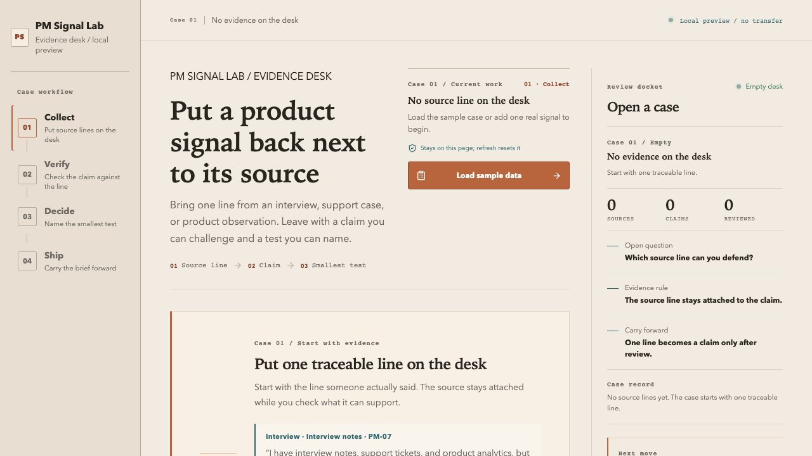

# PM Signal Lab

> Put a product signal back next to its source.

PM Signal Lab is a local-first product evidence workbench for turning raw product signals into source-linked claims, human review decisions, and the smallest next test.

**Hosted preview:** [asdc163.github.io/pm-signal-lab](https://asdc163.github.io/pm-signal-lab/)

**Public pilot:** The current release is looking for five international PMs, founders, designers, or product engineers to complete one unguided five-minute trial. Use the [session kit](./docs/operations/pm-session-kit.md), then leave one concrete observation in [pilot issue #4](https://github.com/asdc163/pm-signal-lab/issues/4).

**International pilot operations:** The human-reviewed channel drafts, evidence-safe message contract, and weekly learning loop are in the [international pilot launch kit](./docs/operations/international-pilot-launch-kit-2026-08-15.md).

**Design and QA evidence:** The current no-AI-feel design contract, local browser evidence, and canonical hosted release audit are in the [design and accessibility contract](./docs/product/pm-signal-lab/44-design-a11y-completion-contract-2026-08-15.md), [local QA record](./docs/product/pm-signal-lab/45-design-a11y-polish-local-qa-2026-08-15.md), and [hosted release audit](./docs/product/pm-signal-lab/46-design-a11y-polish-hosted-release-audit-2026-08-15.md).

This is an AI product manager portfolio project by [John Wu](https://github.com/asdc163). The product demonstrates evidence handling, uncertainty, experiment design, and honest handoff. It does not pretend that a deterministic fixture is a model, that a copied summary is adoption, or that an exported brief is a completed decision.

## Five-minute trial

No login or API key is required.

1. Open the [hosted preview](https://asdc163.github.io/pm-signal-lab/) and select `Load sample data`.
2. Expand one row with `View source`. Check the source folio, original text, date, and limitation.
3. Select `Start review`. Accept one claim, edit one, or keep one as a hypothesis.
4. Open `Decide`, choose a direction, and select `Draft smallest experiment`.
5. Review the primary metric, guardrail, smallest test, decision rule, and `Not covered` section.
6. Export, copy, or download the Markdown decision brief.
7. In `Ship`, open `Help decide what to fix next` after the brief. Three lines are enough: what you expected, where you hesitated, and one change that would make you try again. Add trust or recovery detail if it matters.
8. Inspect the generated field note before opening the public GitHub feedback page. Submission is always manual.

The product path is:

`Collect → Verify → Decide → Ship`

The point is to make the source, claim, limitation, and next action visible in one path. It is not to make you trust an opaque answer.



## What is in the preview

- A deterministic sample pack containing interview, support, product observation, and competitive-scan signals.
- A source ledger with stable folios, source identity, dates, original text, and an expandable source view.
- Candidate claims that keep their source mapping and limitation visible.
- Human review actions: accept a claim, edit it, keep it as a hypothesis, or mark missing evidence.
- An editable experiment brief with a primary metric, guardrail, smallest test, decision rule, owner, and readiness state.
- A Markdown decision brief with evidence, known limits, next action, and a `Not covered` section.
- A local session receipt and a privacy-gated session feedback field note that never includes raw evidence.
- Responsive desktop, tablet, mobile, keyboard, loading, empty, error, and recovery states.

All session content stays on the current page and resets on refresh. The preview has no login, database, external AI provider, API-key flow, GitHub mutation, MCP action, telemetry, or automatic issue submission. Copy or download anything you want to keep before leaving or refreshing.

## Why this product exists

AI lowers the cost of producing a summary. The harder PM questions remain:

- Which line came from which source?
- What is observation, what is a claim, and what is still a hypothesis?
- Which limitation changes the decision?
- What is the smallest test that could change what we do next?

PM Signal Lab treats those questions as a product workflow. The interface keeps human review visible and keeps missing evidence from becoming a confident-looking conclusion.

The product direction was informed by a reference study of 1,042 public GitHub repositories, including metadata, README structure, and 20 near-neighbor case studies. Read the [English research summary](./docs/research/github-reference-research-2026-08-14.en.md) and the [original working note](./docs/research/github-reference-research-2026-08-14.md). This is a reference corpus, not adoption evidence or a success guarantee.

## Quickstart

Requirements: Node.js 20.19+ and npm.

```bash
npm install
npm run dev
```

Open the Vite URL and follow `Collect → Verify → Decide → Ship`.

Before submitting a change, run the local gate:

```bash
npm test
npm run lint
npm run build
```

## Product and engineering shape

The core domain path is:

`Evidence → Claim → ExperimentBrief → DecisionMemo`

The UI and domain engine are separate so a future provider adapter can be evaluated without putting API keys, model drift, or external side effects into the first release.

- [`src/App.tsx`](./src/App.tsx) composes the workflow, states, accessible controls, and local interactions.
- [`src/domain/synthesis.ts`](./src/domain/synthesis.ts) builds deterministic candidate claims and experiment drafts.
- [`src/domain/export.ts`](./src/domain/export.ts) enforces the decision-brief readiness gate and Markdown export.
- [`src/domain/feedback.ts`](./src/domain/feedback.ts) prepares a privacy-gated session field note.
- [`src/domain/fixture.ts`](./src/domain/fixture.ts) holds the repeatable product-discovery sample pack.
- [`src/styles.css`](./src/styles.css) defines the warm-paper workbench, evidence spine, index rail, and responsive layout.
- [`.github/workflows/deploy-pages.yml`](./.github/workflows/deploy-pages.yml) builds and deploys the hosted preview from `main`.
- [`DESIGN.md`](./DESIGN.md) records the visual DNA, tokens, states, and layout rules.

The current English-first product contract is [`34-english-first-product-messaging-contract-2026-08-15.md`](./docs/product/pm-signal-lab/34-english-first-product-messaging-contract-2026-08-15.md). The latest hosted evidence is recorded in [`43-pilot-note-feedback-loop-hosted-release-audit-2026-08-15.md`](./docs/product/pm-signal-lab/43-pilot-note-feedback-loop-hosted-release-audit-2026-08-15.md). Historical audits remain available as a release trail.

## English-first public preview

The released product surface is `en-US`: UI copy, sample data, generated Markdown, accessible names, page metadata, README, trial kit, and public feedback handoff. Historical audits remain in the repository as an evidence trail; the current contract and release audit are written in English.

This release intentionally does not add a locale selector or runtime translation framework. The next localization decision should follow evidence from international PM sessions, not an assumption that more language options automatically improve the first-run job.

## What this does not claim

- This is not a production AI-quality benchmark.
- The preview has no external model provider, so it does not prove model quality.
- No real-user task sessions, retention, conversion, adoption, or GitHub growth outcome are claimed by this repository.
- GitHub stars, forks, traffic, and issue activity are external results; a polished preview is not evidence of any target number.
- The `4 of 5` threshold inside the experiment brief is a proposed decision rule, not completed research.

## Try it and report one observation

If you are a PM, founder, product designer, or product engineer, use the [five-minute session kit](./docs/operations/pm-session-kit.md) without a maintainer walkthrough. The most useful report is one concrete hesitation, trust or doubt signal, recovery moment, and one change you would make.

The public feedback issue is [#4](https://github.com/asdc163/pm-signal-lab/issues/4) and is pinned in the repository. The copy-ready handoff is [`public-pilot-issue-body.md`](./docs/operations/public-pilot-issue-body.md). Review every line before submitting. Do not include customer names, private tickets, API keys, tokens, confidential roadmap material, or raw sensitive evidence.

Stars are optional. Specific, reproducible feedback is more useful than a number that cannot explain what happened.

## Promotion gates

The next product decision is gated by evidence, not visual polish:

1. Collect at least five target-user task sessions before evaluating an external model or provider adapter.
2. Evaluate a portable JSON schema only if several external workflows ask to bring their own evidence pack.
3. Consider read-only GitHub or MCP integration only after source provenance and approval behavior are stable.
4. Keep login, telemetry, and external mutation out of the hosted preview until usability evidence and explicit authorization support that scope.

## License

No license has been declared yet. Unless written permission says otherwise, treat this repository as a readable public preview and do not republish it or include its code in a commercial product.
