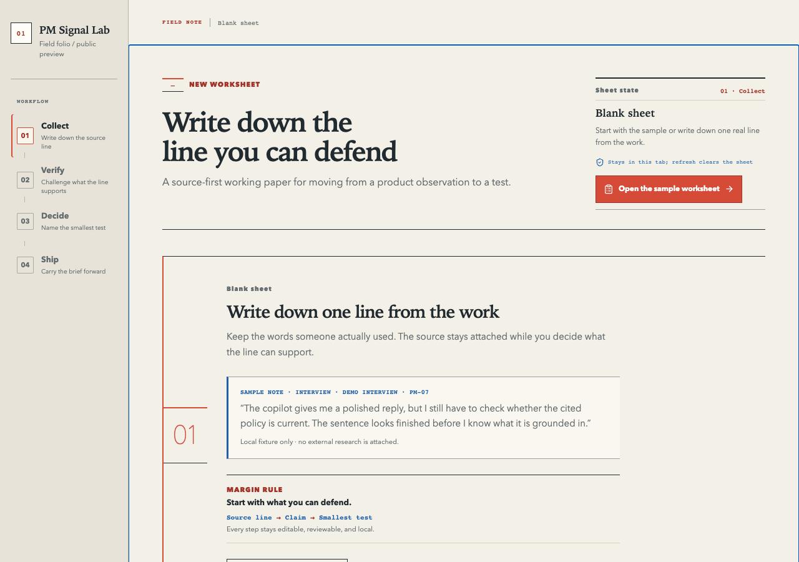

# PM Signal Lab

> Keep the source line attached to the decision it may support.

Latest visual pass: [less-AI field folio visual contract](./docs/product/pm-signal-lab/69-less-ai-field-folio-visual-direction-contract-2026-08-15.md), [subject-specificity contract](./docs/product/pm-signal-lab/72-less-ai-subject-specificity-contract-2026-08-15.md), [domain-language contract](./docs/product/pm-signal-lab/75-less-ai-domain-language-contract-2026-08-15.md), [current local QA report](./docs/product/pm-signal-lab/76-less-ai-domain-language-local-qa-2026-08-15.md), and [previous hosted release audit](./docs/product/pm-signal-lab/74-less-ai-subject-specificity-hosted-release-audit-2026-08-15.md). The latest `main` deploy and hosted smoke have passed; this activation slice changes skills and docs only, not the hosted runtime.

PM Signal Lab is a local-first product evidence field folio for turning raw signals into source-linked claims, human review decisions, and the smallest next test. The public fixture uses an AI-assisted support-draft review because the product is meant to show AI-PM judgment, not because the interface pretends to be an assistant.

**Hosted demo:** [asdc163.github.io/pm-signal-lab](https://asdc163.github.io/pm-signal-lab/)

**Hosted demo boundary:** This is a formal static demo surface for an English-first, local-first product. The canonical URL, hashed assets, current product copy, and deployment state are checked by the [hosted demo smoke contract](./docs/operations/hosted-demo-release-contract-2026-08-15.md). It has no backend persistence, external model provider, telemetry, or automatic GitHub submission.

## Portable PM skills

This repository ships seventy-one small, tool-free Agent Skills for evidence-first PM
work:

### Choose a first run by the PM job

Start with one route that matches the work in front of you. Every first-run
fixture is fictional; it is a way to inspect the workflow, not evidence of a
live result.

| If you have... | Start here | You should leave with... |
| --- | --- | --- |
| Raw product notes | [`pm-source-to-test`](./skills/pm-source-to-test/SKILL.md) | A source ledger, bounded claims, and one smallest test |
| An AI, platform, or market change | [`pm-trend-to-decision`](./skills/pm-trend-to-decision/SKILL.md) | An impact map, bounded implications, and one validation |
| A test or rollout result | [`pm-experiment-to-readout`](./skills/pm-experiment-to-readout/SKILL.md) | A metric/guardrail readout and a continue, change, stop, or hold decision |
| A user or session observation | [`pm-feedback-to-fix`](./skills/pm-feedback-to-fix/SKILL.md) | A reproduction path, smallest fix, and acceptance checks |
| A decision ready for delivery | [`pm-decision-to-spec`](./skills/pm-decision-to-spec/SKILL.md) | A bounded spec with states, scope, measurement, and rollback |
| An AI workflow that needs human boundaries | [`pm-ai-task-boundary`](./skills/pm-ai-task-boundary/SKILL.md) | Ownership, approval points, fallback, and a safe pilot |
| AI review scores that may drive a release decision | [`pm-ai-review-to-calibration`](./skills/pm-ai-review-to-calibration/SKILL.md) | Rubric anchors, blind labels, reviewer agreement, judge comparison, and adjudication |
| An AI flow needs honest uncertainty states and recovery | [`pm-ai-uncertainty-to-experience`](./skills/pm-ai-uncertainty-to-experience/SKILL.md) | User-visible states, provenance, controls, recovery, and trust evaluation |
| An AI result needs to become a bounded interface | [`pm-ai-output-to-interface`](./skills/pm-ai-output-to-interface/SKILL.md) | Output mode, schema/catalog, states, fallback, side effects, and host/a11y evaluation |
| An AI result must cross a reliable schema boundary | [`pm-ai-output-to-schema`](./skills/pm-ai-output-to-schema/SKILL.md) | Route, schema/version, refusal/incomplete/parse states, recovery, evidence, and authority separation |
| An AI output needs a real quality decision | [`pm-ai-output-to-eval`](./skills/pm-ai-output-to-eval/SKILL.md) | Evaluation unit, slices, oracle layers, abstention, calibration, drift, denominator, and release gate |
| An independent AI evaluation needs a defensible release decision | [`pm-ai-independent-eval-to-release`](./skills/pm-ai-independent-eval-to-release/SKILL.md) | Claim class, evaluator independence, harness and budget, validity hazards, publication boundary, remediation, and rollback |
| An AI product needs to choose an improvement lever | [`pm-ai-improvement-to-route`](./skills/pm-ai-improvement-to-route/SKILL.md) | Failure localization, route eligibility, smallest paired test, data/permission gates, and a truthful next decision |
| An AI workflow needs to turn outcomes into an improvement finding | [`pm-ai-outcome-to-improvement`](./skills/pm-ai-outcome-to-improvement/SKILL.md) | Proposal-to-outcome evidence chain, correction taxonomy, reviewed grouping, denominator, owner, and smallest next action |
| An AI signal changes across time | [`pm-ai-drift-to-diagnosis`](./skills/pm-ai-drift-to-diagnosis/SKILL.md) | Comparable windows, exposure/denominator checks, drift taxonomy, smallest next comparison, and a truthful route |
| An AI monitor needs human oversight | [`pm-ai-monitor-to-oversight`](./skills/pm-ai-monitor-to-oversight/SKILL.md) | Observation scope, coverage, timing, review states, control evidence, containment, and an honest safety-case boundary |
| An AI workflow may be ready for more exposure | [`pm-ai-workflow-to-scale`](./skills/pm-ai-workflow-to-scale/SKILL.md) | Maturity, accepted outcomes, guardrails, cost per accepted outcome, demand, capacity, rollout, and rollback |
| A tested AI workflow needs a supportable team introduction | [`pm-ai-workflow-to-adoption`](./skills/pm-ai-workflow-to-adoption/SKILL.md) | Team rhythm, limited introduction, enablement, support/fallback, real-use evidence, feedback-to-change, and the next decision |
| A tested AI workflow needs a reusable operating package | [`pm-ai-workflow-to-package`](./skills/pm-ai-workflow-to-package/SKILL.md) | Repeatable steps, reusable assets, human review, evidence boundaries, support/fallback, ownership, change, and retirement |
| An AI portfolio needs an evidence-bounded sequence | [`pm-ai-portfolio-to-sequence`](./skills/pm-ai-portfolio-to-sequence/SKILL.md) | Candidate cards, value models, foundations, dependencies, capacity, concurrency, stage gates, and Start/Next/Parallel/Hold/Stop/Retire routes |
| An AI workflow needs an evidence-bounded business case | [`pm-ai-value-to-investment`](./skills/pm-ai-value-to-investment/SKILL.md) | Successful work unit, full cost, dependability, value assumptions, scenarios, sensitivity, capacity, and an investment route |
| An AI product needs a bounded live voice or audio session | [`pm-ai-realtime-to-session`](./skills/pm-ai-realtime-to-session/SKILL.md) | Session type, identity, turn-taking, interruption, transport, credential, tools, consent, recovery, and release evidence |
| An AI product needs meaning preserved across languages | [`pm-ai-translation-to-meaning`](./skills/pm-ai-translation-to-meaning/SKILL.md) | Source/target locale, meaning ledger, terminology, ambiguity, correction, privacy, target-user parity, and release evidence |
| An AI agent needs to research a complex question with evidence | [`pm-ai-research-to-evidence`](./skills/pm-ai-research-to-evidence/SKILL.md) | Decision frame, source policy, research plan, tool/data boundary, claim ledger, uncertainty, progress, review, and release gate |
| An AI product must understand a visual artifact before a decision | [`pm-ai-vision-to-decision`](./skills/pm-ai-vision-to-decision/SKILL.md) | Artifact/page/region provenance, extraction route, layout/table/chart fidelity, ambiguity, accessibility, review, and release gate |
| An AI capability needs a meaningful first use | [`pm-ai-first-use-to-activation`](./skills/pm-ai-first-use-to-activation/SKILL.md) | First-value oracle, activation candidates, instrumentation, guardrails, recovery, and rollout decision |
| An AI product needs repeat value after first use | [`pm-ai-value-to-retention`](./skills/pm-ai-value-to-retention/SKILL.md) | Natural cadence, repeat-value oracle, cohorts, freshness, reactivation, suppression, and trust guardrails |
| An AI capability needs the right user intent | [`pm-ai-intent-to-discovery`](./skills/pm-ai-intent-to-discovery/SKILL.md) | Positive/negative routing, suggestions, clarification, abstention, disclosure, host mismatch, and manual fallback |
| An AI recommendation needs a human decision boundary | [`pm-ai-recommendation-to-decision`](./skills/pm-ai-recommendation-to-decision/SKILL.md) | Evidence, alternatives, inspect/accept/edit/reject/defer choices, abstention, side-effect separation, and decision receipts |
| An AI task may run across waits or restarts | [`pm-ai-task-to-progress`](./skills/pm-ai-task-to-progress/SKILL.md) | Stable identity, honest progress, input/approval waits, pause/resume/cancel/retry, terminal proof, expiry, and recovery |
| AI context may personalize an experience | [`pm-ai-preference-to-personalization`](./skills/pm-ai-preference-to-personalization/SKILL.md) | Source, purpose, scope, freshness, precedence, inspect/edit/forget/delete/pause/opt-out/temporary controls, and safe fallback |
| An AI agent may operate a graphical UI | [`pm-ai-computer-use-to-control`](./skills/pm-ai-computer-use-to-control/SKILL.md) | Observation mode, action scope, postconditions, human stop points, sensitive-screen/injection boundaries, mismatch recovery, and manual fallback |
| A prompt change may reach users | [`pm-ai-prompt-to-version`](./skills/pm-ai-prompt-to-version/SKILL.md) | Prompt identity, input/output contracts, behavioral diff, baseline/candidate evidence, rollout, cost/latency guardrails, and rollback |
| An AI capability should be packaged for agents | [`pm-ai-skill-to-package`](./skills/pm-ai-skill-to-package/SKILL.md) | Discovery triggers, progressive disclosure, permissions, surface compatibility, provenance, verification, versioning, disablement, and rollback |
| An AI model or provider may need to migrate safely | [`pm-ai-model-change-to-migration`](./skills/pm-ai-model-change-to-migration/SKILL.md) | Model identity, lifecycle change, blast radius, baseline/candidate comparison, safety, cost, latency, canary, hold, and rollback |
| An AI task may continue after the user leaves | [`pm-ai-background-run-to-supervision`](./skills/pm-ai-background-run-to-supervision/SKILL.md) | Scope, autonomy, queued/working/paused/cancelled states, real checkpoints, expiry, notifications, result review, retention, and recovery |
| An MCP or agent connector needs a safe access boundary | [`pm-ai-mcp-to-authorization`](./skills/pm-ai-mcp-to-authorization/SKILL.md) | Resource and issuer discovery, consent, scope, tool side effects, token lifecycle, task isolation, recovery, and release evidence |
| An agent needs user input before it can continue | [`pm-ai-agent-elicitation-to-input`](./skills/pm-ai-agent-elicitation-to-input/SKILL.md) | Purpose, provenance, minimal schema, sensitivity, user controls, decline/cancel/timeout states, validation, recovery, and side-effect separation |
| An agent tool call needs safe result pairing and recovery | [`pm-ai-tool-call-to-recovery`](./skills/pm-ai-tool-call-to-recovery/SKILL.md) | Call/result correlation, parallel batches, error classes, bounded retry, idempotency, duplicate/late results, manual fallback, and outcome verification |
| An agent has too many tools to expose at once | [`pm-ai-tool-search-to-selection`](./skills/pm-ai-tool-search-to-selection/SKILL.md) | Catalog scope, hosted/client search, deferred loading, candidate eligibility, abstention, stale/ambiguous states, and selection evidence |
| A model-generated program may call several tools | [`pm-ai-program-to-result`](./skills/pm-ai-program-to-result/SKILL.md) | Direct/program route, parent/child caller linkage, eligible tools, budgets, output/final-message validation, recovery, and outcome evidence |
| AI-generated code may run in a product | [`pm-ai-code-run-to-sandbox`](./skills/pm-ai-code-run-to-sandbox/SKILL.md) | Sandbox, filesystem, network, package, secret, approval, cancellation, artifact provenance, and verification contract |
| An agent may delegate a bounded subtask | [`pm-ai-subagent-to-delegation`](./skills/pm-ai-subagent-to-delegation/SKILL.md) | Manager-versus-handoff route, context filter, authority, ownership, guardrail coverage, result verification, and recovery |
| AI guardrails need an enforceable boundary | [`pm-ai-guardrail-to-enforcement`](./skills/pm-ai-guardrail-to-enforcement/SKILL.md) | Coverage map, input/output/tool/handoff timing, serial-versus-parallel tradeoff, tripwire, failure, recovery, and residual risk |
| AI content needs a policy-to-moderation decision | [`pm-ai-content-to-moderation`](./skills/pm-ai-content-to-moderation/SKILL.md) | Taxonomy, severity/action matrix, lifecycle timing, human review, appeals, false-pass/false-block slices, privacy, and release gate |
| AI content provenance needs a bounded trust decision | [`pm-ai-provenance-to-trust`](./skills/pm-ai-provenance-to-trust/SKILL.md) | Asset identity, history, bindings, signer/trust scope, watermark signals, verification states, user copy, privacy, and downstream boundaries |
| An AI signal may require a product intervention | [`pm-ai-signal-to-intervention`](./skills/pm-ai-signal-to-intervention/SKILL.md) | Evidence validation, intervention scope, owner/TTL, recovery, and rollback |
| An agent, tool, or document may carry an injection | [`pm-ai-prompt-injection-to-defense`](./skills/pm-ai-prompt-injection-to-defense/SKILL.md) | Attack path, authority boundary, smallest defense, negative evals, and release decision |

Use the smallest matching skill first; do not chain all seventy-one before
you know what the next decision needs.

- [`pm-source-to-test`](./skills/pm-source-to-test/SKILL.md) turns raw product
  notes into a source ledger, candidate claims, limitations, and one smallest
  test. Start with its [fictional support-draft first run](./skills/pm-source-to-test/examples/first-run.md) or read the [worked support-draft review](./skills/pm-source-to-test/references/support-draft-review.md).
- [`pm-trend-to-decision`](./skills/pm-trend-to-decision/SKILL.md) turns an AI,
  platform, developer-tool, or market change note into an impact map, bounded
  implications, and one smallest validation. Start with its [fictional platform-change first run](./skills/pm-trend-to-decision/examples/first-run.md) or read the [worked platform-change review](./skills/pm-trend-to-decision/references/platform-change-review.md).
- [`pm-experiment-to-readout`](./skills/pm-experiment-to-readout/SKILL.md)
  turns a bounded test result into a metric and guardrail readout, a
  continue/change/stop/hold decision, and one smallest next action. Start with
  its [fictional experiment first run](./skills/pm-experiment-to-readout/examples/first-run.md) or read the [worked experiment readout](./skills/pm-experiment-to-readout/references/experiment-readout.md).
- [`pm-ai-evaluation-plan`](./skills/pm-ai-evaluation-plan/SKILL.md) turns an AI
  feature goal into test slices, an observable rubric, guardrails, fallback, and
  a release gate. Start with its [fictional AI evaluation first run](./skills/pm-ai-evaluation-plan/examples/first-run.md) or read the [worked AI support evaluation plan](./skills/pm-ai-evaluation-plan/references/ai-support-evaluation-plan.md).
- [`pm-ai-independent-eval-to-release`](./skills/pm-ai-independent-eval-to-release/SKILL.md)
  turns an independent or third-party AI evaluation into a bounded release
  decision. It keeps claim class, evaluator independence, system and harness,
  budget, validity hazards, access, publication, remediation, and rollback
  visible; it does not treat a report or red-team exercise as a safety,
  adoption, or production guarantee. Start with its [fictional support-triage
  first run](./skills/pm-ai-independent-eval-to-release/examples/first-run.md)
  or read the [worked independent evaluation release brief](./skills/pm-ai-independent-eval-to-release/references/independent-evaluation-release-brief.md).
- [`pm-ai-improvement-to-route`](./skills/pm-ai-improvement-to-route/SKILL.md)
  turns an observed AI quality, trust, cost, latency, coverage, or completion
  gap into a source-bounded choice among prompt, context, retrieval, tool,
  orchestration, model, data, UX, and fine-tuning routes. It keeps failure
  localization, route eligibility, paired evaluation, permission, rollback,
  and the `Need evidence` boundary visible. Start with its [fictional
  support-triage first run](./skills/pm-ai-improvement-to-route/examples/first-run.md)
  or read the [route evidence reference](./skills/pm-ai-improvement-to-route/references/route-evidence.md).
- [`pm-ai-outcome-to-improvement`](./skills/pm-ai-outcome-to-improvement/SKILL.md)
  turns a proposal, human correction, downstream artifact, or verified outcome
  into an evidence-bounded improvement finding. It separates model error,
  source or mapping gaps, product support, human preference, expected workflow
  variance, downstream state, and operational failure; it keeps identity joins,
  review, grouping, denominator, privacy, owner, rollback, and `Need evidence`
  visible. Start with its [fictional document-review first run](./skills/pm-ai-outcome-to-improvement/examples/first-run.md)
  or read the [outcome finding reference](./skills/pm-ai-outcome-to-improvement/references/outcome-finding.md).
- [`pm-ai-drift-to-diagnosis`](./skills/pm-ai-drift-to-diagnosis/SKILL.md)
  turns a changed AI quality, behavior, cost, latency, coverage, or completion
  signal into a comparable-window diagnosis. It separates input mix, source
  freshness, oracle/label, model/provider, prompt/tool/config, product,
  policy, instrumentation, operational, expected-variance, and unknown
  explanations before choosing observe, investigate, eval, narrow, hold, or a
  rollback candidate. Start with its [fictional support-triage first run](./skills/pm-ai-drift-to-diagnosis/examples/first-run.md)
  or read the [drift diagnosis reference](./skills/pm-ai-drift-to-diagnosis/references/drift-diagnosis.md).
- [`pm-ai-monitor-to-oversight`](./skills/pm-ai-monitor-to-oversight/SKILL.md)
  turns an AI or agent monitor signal into a bounded human-oversight contract.
  It separates monitor prediction, observed behavior, human review, control
  action, downstream outcome, and safety-case evidence; it keeps scope,
  coverage gaps, async/sync timing, reviewer authority, control evaluations,
  privacy, and containment visible. Start with its [fictional coding-agent
  first run](./skills/pm-ai-monitor-to-oversight/examples/first-run.md) or read
  the [monitor-to-oversight reference](./skills/pm-ai-monitor-to-oversight/references/monitor-oversight.md).
- [`pm-ai-workflow-to-scale`](./skills/pm-ai-workflow-to-scale/SKILL.md) turns
  an AI workflow demo, validation, or pilot into an evidence-bounded `Explore`,
  `Validate`, `Pilot`, `Scale gradually`, `Narrow`, `Hold`, or `Retire`
  decision. It separates usage, output quality, accepted outcome, business
  value, operating readiness, demand, capacity, support, and adoption; it keeps
  cost per accepted outcome, guardrails, rollout, stop rule, and rollback
  visible. Start with its [fictional support-draft scale review](./skills/pm-ai-workflow-to-scale/examples/first-run.md)
  or read the [workflow scale reference](./skills/pm-ai-workflow-to-scale/references/workflow-scale.md).
- [`pm-ai-workflow-to-adoption`](./skills/pm-ai-workflow-to-adoption/SKILL.md)
  turns a tested AI workflow into a bounded team introduction and adoption
  evidence plan. It connects the workflow to a real team rhythm, limited
  audience, enablement, support and manual fallback, evidence ownership,
  feedback-to-change, and a `Continue`, `Revise`, `Pause`, `Stop`, or `Consider
  broader use` decision. It keeps access, repeated useful behavior, quality,
  overrides, exceptions, support burden, experience, outcome, and causality
  separate. Start with its [fictional support-draft first run](./skills/pm-ai-workflow-to-adoption/examples/first-run.md)
  or read the [workflow adoption reference](./skills/pm-ai-workflow-to-adoption/references/workflow-adoption.md).
- [`pm-ai-workflow-to-package`](./skills/pm-ai-workflow-to-package/SKILL.md)
  turns a tested AI workflow into an evidence-bounded operating package that
  another person can repeat, review, support, maintain, change, or retire. It
  keeps the user/job, before/after boundary, inputs and approved sources,
  reusable asset, human review, evidence labels, owner, support/fallback,
  versioning, and retirement visible without calling a package adoption or
  value proof. Start with its [fictional support-draft package](./skills/pm-ai-workflow-to-package/examples/first-run.md)
  or read the [workflow package reference](./skills/pm-ai-workflow-to-package/references/workflow-package.md).
- [`pm-ai-portfolio-to-sequence`](./skills/pm-ai-portfolio-to-sequence/SKILL.md)
  turns several AI workflow or capability candidates into an evidence-bounded
  portfolio sequence. It keeps user/job, value model, maturity, foundations,
  typed dependencies, capacity, concurrency, evidence gates, opportunity
  cost, and reorder authority visible, then places candidates at `Start`,
  `Foundation first`, `Parallel`, `Next`, `Hold`, `Stop`, or `Retire`.
  Start with its [fictional support-workflow portfolio](./skills/pm-ai-portfolio-to-sequence/examples/first-run.md)
  or read the [portfolio sequence reference](./skills/pm-ai-portfolio-to-sequence/references/portfolio-sequence.md).
- [`pm-ai-value-to-investment`](./skills/pm-ai-value-to-investment/SKILL.md)
  turns one AI workflow into an evidence-bounded value-to-investment brief. It
  defines a successful work unit, full cost including retries and human review,
  dependability, value assumptions, low/base/high scenarios, sensitivity,
  capacity, opportunity cost, and an `Invest`, `Test`, `Narrow`, `Hold`, or
  `Stop` route. It keeps token price, usage, accepted work, proxy value,
  realized value, and business value separate. Start with its [fictional
  support-draft value case](./skills/pm-ai-value-to-investment/examples/first-run.md)
  or read the [value-to-investment reference](./skills/pm-ai-value-to-investment/references/value-investment.md).
- [`pm-feedback-to-fix`](./skills/pm-feedback-to-fix/SKILL.md) turns a de-identified
  product observation into a bounded reproduction path, smallest fix or
  experiment, acceptance checks, and release/rollback notes. Start with its
  [fictional feedback first run](./skills/pm-feedback-to-fix/examples/first-run.md)
  or read the [worked pilot observation](./skills/pm-feedback-to-fix/references/pilot-observation-to-fix.md).
- [`pm-decision-to-spec`](./skills/pm-decision-to-spec/SKILL.md) turns an
  evidence-backed product decision into a bounded Product Decision Packet with
  scope, UX states, acceptance criteria, measurement, rollout, and rollback.
  Start with its [fictional decision first run](./skills/pm-decision-to-spec/examples/first-run.md)
  or read the [worked support-review packet](./skills/pm-decision-to-spec/references/support-review-decision-packet.md).
- [`pm-proof-to-share`](./skills/pm-proof-to-share/SKILL.md) turns a verified
  product or skill release into an evidence-backed, channel-aware share pack
  with a clear first-use path, proof ledger, boundaries, feedback ask, and
  learning writeback. Start with its [fictional proof first run](./skills/pm-proof-to-share/examples/first-run.md)
  or read the [worked release proof share pack](./skills/pm-proof-to-share/references/release-proof-share-pack.md).
- [`pm-interview-to-insight`](./skills/pm-interview-to-insight/SKILL.md) turns
  de-identified interview notes, usability sessions, or workflow observations
  into an evidence-bounded insight map, contradiction log, and one next
  learning action. Start with its [fictional interview first run](./skills/pm-interview-to-insight/examples/first-run.md)
  or read the [worked support-interview insight map](./skills/pm-interview-to-insight/references/support-interview-insight-map.md).
- [`pm-outcome-to-metric`](./skills/pm-outcome-to-metric/SKILL.md) turns a
  product outcome or AI product goal into an evidence-bounded metric contract
  with a primary measure, denominator, window, guardrails, instrumentation
  gaps, and a decision rule. Start with its [fictional metric first run](./skills/pm-outcome-to-metric/examples/first-run.md)
  or read the [worked support-review metric contract](./skills/pm-outcome-to-metric/references/support-review-metric-contract.md).
- [`pm-release-to-learn`](./skills/pm-release-to-learn/SKILL.md) turns a
  verified release into a bounded rollout-and-learning plan with an audience,
  observation window, primary learning signal, guardrails, rollback trigger,
  feedback capture, and next decision. Start with its [fictional release first run](./skills/pm-release-to-learn/examples/first-run.md)
  or read the [worked support-review release learning plan](./skills/pm-release-to-learn/references/support-review-release-learning.md).
- [`pm-opportunity-to-bet`](./skills/pm-opportunity-to-bet/SKILL.md) turns
  multiple evidence-backed opportunity candidates into one bounded product bet
  with a source ledger, assumptions, opportunity cost, smallest validation,
  non-goals, and a stop or revise rule. Start with its [fictional bet first run](./skills/pm-opportunity-to-bet/examples/first-run.md)
  or read the [worked support-opportunity bet](./skills/pm-opportunity-to-bet/references/support-opportunity-bet.md).
- [`pm-ai-task-boundary`](./skills/pm-ai-task-boundary/SKILL.md) decides how an
  AI capability divides work between a person and an AI system by mapping the
  user job to a SCAN zone, autonomy level, permissions, approval points,
  fallback, evaluation slices, and a smallest safe pilot. Start with its
  [fictional task-boundary first run](./skills/pm-ai-task-boundary/examples/first-run.md)
  or read the [worked support AI task boundary](./skills/pm-ai-task-boundary/references/support-ai-task-boundary.md).
- [`pm-ai-trace-to-regression`](./skills/pm-ai-trace-to-regression/SKILL.md)
  turns an AI or agent failure trace, tool error, user correction, or guardrail
  event into a bounded failure classification, containment step, minimal
  reproduction, regression case, and release decision. Start with its
  [fictional trace first run](./skills/pm-ai-trace-to-regression/examples/first-run.md)
  or read the [worked support trace-to-regression packet](./skills/pm-ai-trace-to-regression/references/support-trace-to-regression.md).
- [`pm-ai-incident-to-runbook`](./skills/pm-ai-incident-to-runbook/SKILL.md)
  turns an AI or agent incident signal into a critical-journey impact map,
  evidence-bounded severity, containment, recovery runbook, verification and
  reopen gate, and learning writeback. Start with its
  [fictional incident first run](./skills/pm-ai-incident-to-runbook/examples/first-run.md)
  or read the [worked support incident packet](./skills/pm-ai-incident-to-runbook/references/support-incident-to-runbook.md).
- [`pm-ai-approval-to-flow`](./skills/pm-ai-approval-to-flow/SKILL.md) turns an
  AI or agent action proposal into a risk-bounded approval flow with preview
  and diff, least-privilege permissions, approve/reject/edit/defer states,
  durable receipts, recovery, and an evaluation or release gate. Start with
  its [fictional approval first run](./skills/pm-ai-approval-to-flow/examples/first-run.md)
  or read the [worked support approval flow](./skills/pm-ai-approval-to-flow/references/support-approval-flow.md).
- [`pm-ai-cost-to-guardrail`](./skills/pm-ai-cost-to-guardrail/SKILL.md) turns an
  AI or agent cost or latency signal into a source-bounded cost ledger,
  successful-outcome denominator, p50/p95 latency budget, quality guardrails,
  routing or scope options, and a ship/hold/rollback decision. Start with its
  [fictional cost guardrail first run](./skills/pm-ai-cost-to-guardrail/examples/first-run.md)
  or read the [worked support cost guardrail](./skills/pm-ai-cost-to-guardrail/references/support-cost-guardrail.md).
- [`pm-ai-context-to-contract`](./skills/pm-ai-context-to-contract/SKILL.md)
  turns an AI or agent context change into a source-bounded contract for
  instructions, knowledge, tools, memory, state, and query, with authority,
  freshness, privacy, selection, budget, compaction, recovery, evaluation,
  and a ship/hold/rollback decision. Start with its
  [fictional context first run](./skills/pm-ai-context-to-contract/examples/first-run.md)
  or read the [worked support context contract](./skills/pm-ai-context-to-contract/references/context-contract.md).
- [`pm-ai-tool-to-contract`](./skills/pm-ai-tool-to-contract/SKILL.md) turns an
  AI or MCP tool into a source-bounded agent-facing contract for purpose,
  namespace, scope, input schema, examples, high-signal output, provenance,
  permissions, side effects, errors, retries, injection handling, positive and
  negative routing, evaluation, and a ship/hold/rollback decision. Start with
  its [fictional tool contract first run](./skills/pm-ai-tool-to-contract/examples/first-run.md)
  or read the [worked support tool contract](./skills/pm-ai-tool-to-contract/references/tool-contract.md).
- [`pm-ai-memory-to-policy`](./skills/pm-ai-memory-to-policy/SKILL.md) turns an
  AI or agent memory idea into a source-bounded policy for user value, memory
  versus state, write and read eligibility, provenance, scope, freshness,
  privacy, retention, correction, deletion, export, reset, poisoning defense,
  evaluation, fallback, and a ship/hold/rollback decision. Start with its
  [fictional memory first run](./skills/pm-ai-memory-to-policy/examples/first-run.md)
  or read the [worked support memory policy](./skills/pm-ai-memory-to-policy/references/memory-policy.md).
- [`pm-ai-identity-to-boundary`](./skills/pm-ai-identity-to-boundary/SKILL.md)
  turns an AI or agent actor into a source-bounded identity and authorization
  contract for principals, authentication, delegation, resource and tenant
  scope, least privilege, approval interaction, credential/session lifecycle,
  expiry, rotation, revocation, attribution, audit receipts, negative tests,
  fallback, and a ship/hold/rollback decision. Start with its [fictional
  identity first run](./skills/pm-ai-identity-to-boundary/examples/first-run.md)
  or read the [worked support identity policy](./skills/pm-ai-identity-to-boundary/references/identity-policy.md).
- [`pm-ai-run-to-observability`](./skills/pm-ai-run-to-observability/SKILL.md)
  turns an AI or agent run into a source-bounded observability contract for
  run/session/task/trace hierarchy, event correlation, provenance, identity
  and scope, model/tool/approval/MCP/network evidence, outcome and guardrails,
  latency and cost links, privacy/redaction, sampling/retention, diagnosis,
  fallback, and a ship/hold/rollback decision. Start with its [fictional run
  observability first run](./skills/pm-ai-run-to-observability/examples/first-run.md)
  or read the [worked support run observability contract](./skills/pm-ai-run-to-observability/references/run-observability.md).
- [`pm-ai-claim-to-citation`](./skills/pm-ai-claim-to-citation/SKILL.md)
  turns an AI answer, research brief, or agent output into a source-bounded
  claim-to-citation contract for atomic claims, entailment, citation coverage
  and placement, source authority and freshness, conflict, uncertainty,
  privacy, prompt-injection boundaries, reader verification, abstention,
  evaluation, fallback, and a ship/hold/rollback decision. Start with its
  [fictional claim review first run](./skills/pm-ai-claim-to-citation/examples/first-run.md)
  or read the [worked support claim-citation contract](./skills/pm-ai-claim-to-citation/references/claim-citation-contract.md).
- [`pm-ai-retrieval-to-grounding`](./skills/pm-ai-retrieval-to-grounding/SKILL.md)
  defines source eligibility, query construction, retrieval, ranking,
  grounding, abstention, privacy, evaluation, and release evidence before an
  AI answer is generated. Start with its [fictional retrieval first run](./skills/pm-ai-retrieval-to-grounding/examples/first-run.md)
  or read the [worked retrieval-grounding contract](./skills/pm-ai-retrieval-to-grounding/references/retrieval-grounding-contract.md).
- [`pm-ai-feedback-to-eval`](./skills/pm-ai-feedback-to-eval/SKILL.md) turns an
  AI user correction, preference, thumbs-down report, escalation, or reviewed
  trace into a privacy-safe evaluation case with provenance, observation and
  label separation, oracle, slice, calibration, contamination checks, dataset
  destination, fallback, and a release decision. Start with its [fictional
  feedback first run](./skills/pm-ai-feedback-to-eval/examples/first-run.md) or
  read the [worked feedback-to-eval contract](./skills/pm-ai-feedback-to-eval/references/feedback-eval-contract.md).
- [`pm-ai-review-to-calibration`](./skills/pm-ai-review-to-calibration/SKILL.md)
  turns human review or model-judge scoring into a calibrated evaluation
  contract for rubric anchors, blind labels, reviewer agreement, judge
  comparison, adjudication, drift, privacy, and release evidence. Start with
  its [fictional calibration first run](./skills/pm-ai-review-to-calibration/examples/first-run.md)
  or read the [worked review-calibration contract](./skills/pm-ai-review-to-calibration/references/review-calibration-contract.md).
- [`pm-ai-uncertainty-to-experience`](./skills/pm-ai-uncertainty-to-experience/SKILL.md)
  turns AI uncertainty, partial evidence, delay, conflict, or failure into a
  user-visible state and recovery contract with honest progress, provenance,
  controls, trust evaluation, and release evidence. Start with its [fictional
  uncertainty first run](./skills/pm-ai-uncertainty-to-experience/examples/first-run.md)
  or read the [worked uncertainty-to-experience contract](./skills/pm-ai-uncertainty-to-experience/references/uncertainty-experience-contract.md).
- [`pm-ai-signal-to-intervention`](./skills/pm-ai-signal-to-intervention/SKILL.md)
  turns an online AI quality, safety, trust, cost, latency, policy, or behavior
  signal into an evidence-bounded intervention decision with scope, owner, TTL,
  user communication, verification, recovery, rollback, and learning writeback.
  Start with its [fictional signal first run](./skills/pm-ai-signal-to-intervention/examples/first-run.md)
  or read the [worked signal-intervention contract](./skills/pm-ai-signal-to-intervention/references/signal-intervention-contract.md).
- [`pm-ai-prompt-injection-to-defense`](./skills/pm-ai-prompt-injection-to-defense/SKILL.md)
  turns a suspected prompt injection, indirect injection, tool poisoning, or
  untrusted agent/MCP content path into an attack-path and defense contract
  with authority boundaries, negative evals, rollback, and a bounded release
  decision. Start with its [fictional prompt-injection first run](./skills/pm-ai-prompt-injection-to-defense/examples/first-run.md)
  or read the [worked defense contract](./skills/pm-ai-prompt-injection-to-defense/references/prompt-injection-defense-contract.md).
- [`pm-ai-output-to-interface`](./skills/pm-ai-output-to-interface/SKILL.md)
  turns an AI or agent result into a bounded decision about text, structured
  data, a declarative interface, or an action proposal. It maps named fields to
  trusted components, states, readable fallback, provenance, side-effect
  boundaries, host compatibility, accessibility, and evaluation. Start with
  its [fictional output-to-interface first run](./skills/pm-ai-output-to-interface/examples/first-run.md)
  or read the [worked output-to-interface contract](./skills/pm-ai-output-to-interface/references/output-to-interface-contract.md).
- [`pm-ai-output-to-schema`](./skills/pm-ai-output-to-schema/SKILL.md) turns an
  AI response or function-call argument into a reviewable schema boundary. It
  records the provider/model/SDK/route, schema and version, required evidence,
  refusal/incomplete/parse/drift states, bounded recovery, streaming commit,
  user-visible fallback, and the boundary between valid shape and authority.
  Start with its [fictional invoice-extraction first run](./skills/pm-ai-output-to-schema/examples/first-run.md)
  or read the [worked output-to-schema contract](./skills/pm-ai-output-to-schema/references/output-schema-contract.md).
- [`pm-ai-output-to-eval`](./skills/pm-ai-output-to-eval/SKILL.md) turns a
  schema-valid output into a repeatable quality and release decision. It
  defines the evaluation unit, source/reference, deterministic and
  human/model oracles, positive/negative/abstain/drift slices, denominator,
  calibration, grader-hacking checks, platform migration, recovery, and
  rollback. Start with its [fictional support-label first run](./skills/pm-ai-output-to-eval/examples/first-run.md)
  or read the [worked output-evaluation contract](./skills/pm-ai-output-to-eval/references/output-evaluation-contract.md).
- [`pm-ai-realtime-to-session`](./skills/pm-ai-realtime-to-session/SKILL.md)
  turns a live voice, translation, or streaming-transcription idea into a
  bounded session contract. It separates session type, identity, authority,
  transport, credentials, turns, interruption, tools, consent, recovery, cost,
  accessibility, evaluation slices, and release evidence. Start with its
  [fictional support-concierge first run](./skills/pm-ai-realtime-to-session/examples/first-run.md)
  or read the [worked realtime session contract](./skills/pm-ai-realtime-to-session/references/realtime-session-contract.md).
- [`pm-ai-translation-to-meaning`](./skills/pm-ai-translation-to-meaning/SKILL.md)
  turns a live or bounded multilingual route into a meaning-preservation
  contract. It separates translation from transcription, localization,
  summarization, and assistant answers, then covers source/target locale,
  entities, numbers, negation, intent, terminology, ambiguity, correction,
  privacy, accessibility, target-user outcome, evaluation slices, and rollback.
  Start with its [fictional live-support first run](./skills/pm-ai-translation-to-meaning/examples/first-run.md)
  or read the [worked translation-to-meaning contract](./skills/pm-ai-translation-to-meaning/references/translation-meaning-contract.md).
- [`pm-ai-research-to-evidence`](./skills/pm-ai-research-to-evidence/SKILL.md)
  turns an agentic research request into a source-backed decision contract. It
  separates the decision question, source authority/freshness, subquestion
  coverage, tool and data permissions, claim-to-source evidence, uncertainty,
  contradictions, prompt injection, private-data boundaries, long-running
  states, and release recovery. Start with its [fictional support-monitoring
  first run](./skills/pm-ai-research-to-evidence/examples/first-run.md) or read
  the [worked research evidence contract](./skills/pm-ai-research-to-evidence/references/research-evidence-contract.md).
- [`pm-ai-vision-to-decision`](./skills/pm-ai-vision-to-decision/SKILL.md)
  turns an image, PDF, screenshot, scan, chart, or visual document into a
  source-bounded decision contract. It separates artifact identity, pages,
  regions, frames, coordinates, OCR/text extraction/vision/table/chart routes,
  layout and value fidelity, ambiguity, accessibility, privacy, embedded
  instructions, review, and rollback. Start with its [fictional pricing-page
  first run](./skills/pm-ai-vision-to-decision/examples/first-run.md) or read
  the [worked vision-to-decision contract](./skills/pm-ai-vision-to-decision/references/vision-decision-contract.md).
- [`pm-ai-first-use-to-activation`](./skills/pm-ai-first-use-to-activation/SKILL.md)
  turns an AI capability launch into a first-use and activation contract. It
  separates eligibility, exposure, context readiness, first value, repeat
  value, and activation, then adds state/recovery coverage, instrumentation,
  guardrails, rollout, and a bounded learning decision. Start with its
  [fictional first-use fixture](./skills/pm-ai-first-use-to-activation/examples/first-run.md)
  or read the [worked first-use to activation contract](./skills/pm-ai-first-use-to-activation/references/first-use-activation-contract.md).
- [`pm-ai-value-to-retention`](./skills/pm-ai-value-to-retention/SKILL.md)
  turns a verified first value into a longitudinal value and retention
  contract. It separates repeat value, retained value, reactivation,
  notification response, and suppression, then adds natural cadence, cohort
  denominators, freshness, quality/trust guardrails, re-entry controls, and
  rollback. Start with its [fictional repeat-value first run](./skills/pm-ai-value-to-retention/examples/first-run.md)
  or read the [worked value-to-retention contract](./skills/pm-ai-value-to-retention/references/value-retention-contract.md).
- [`pm-ai-intent-to-discovery`](./skills/pm-ai-intent-to-discovery/SKILL.md)
  turns a user job into a bounded AI discovery and routing contract. It
  separates direct calls, contextual suggestions, clarification, abstention,
  invocation, first-use handoff, and manual fallback, then covers positive,
  negative, ambiguous, benign-lookalike, permission, host-mismatch, and
  recovery evidence. Start with its [fictional accessibility-review first run](./skills/pm-ai-intent-to-discovery/examples/first-run.md)
  or read the [worked intent-to-discovery contract](./skills/pm-ai-intent-to-discovery/references/intent-discovery-contract.md).
- [`pm-ai-recommendation-to-decision`](./skills/pm-ai-recommendation-to-decision/SKILL.md)
  turns an AI recommendation, ranking, triage suggestion, or plan into a
  source-bounded human decision contract. It separates evidence, uncertainty,
  alternatives, inspect/accept/edit/reject/defer/manual choices, abstention,
  consequential execution, decision receipts, and downstream outcomes. Start
  with its [fictional support-escalation first run](./skills/pm-ai-recommendation-to-decision/examples/first-run.md)
  or read the [worked recommendation-to-decision contract](./skills/pm-ai-recommendation-to-decision/references/recommendation-decision-contract.md).
- [`pm-ai-task-to-progress`](./skills/pm-ai-task-to-progress/SKILL.md)
  turns a long-running or asynchronous AI task into a source-bounded lifecycle
  contract. It separates task identity, queued/working/input/approval/paused/
  cancelling/cancelled/failed/expired/completed states, observed progress,
  pause/resume/cancel/retry controls, terminal proof, host fallback, and
  privacy-safe receipts. Start with its [fictional evidence-digest first run](./skills/pm-ai-task-to-progress/examples/first-run.md)
  or read the [worked task-to-progress contract](./skills/pm-ai-task-to-progress/references/task-progress-contract.md).
- [`pm-ai-preference-to-personalization`](./skills/pm-ai-preference-to-personalization/SKILL.md)
  turns AI personalization context into a source-bounded user-control
  contract. It separates one-off instructions, durable preferences, contextual
  facts, inferred traits, sensitive details, workspace policy, and consent, then
  adds purpose, scope, freshness, precedence, correction, deletion, pause,
  opt-out, temporary use, shared-context boundaries, privacy-safe receipts, and
  evaluation slices. Start with its [fictional travel-planning first run](./skills/pm-ai-preference-to-personalization/examples/first-run.md)
  or read the [worked preference-to-personalization contract](./skills/pm-ai-preference-to-personalization/references/preference-personalization-contract.md).
- [`pm-ai-computer-use-to-control`](./skills/pm-ai-computer-use-to-control/SKILL.md)
  turns a screen-based AI agent into a source-bounded control contract. It
  separates semantic/DOM observation, screenshot/vision gaps, proposed and
  confirmed actions, postcondition proof, stale-screen and mismatch recovery,
  sensitive-screen and prompt-injection boundaries, permission/CAPTCHA stops,
  manual fallback, privacy-safe receipts, and evaluation slices. Start with
  its [fictional support-portal first run](./skills/pm-ai-computer-use-to-control/examples/first-run.md)
  or read the [worked computer-use control contract](./skills/pm-ai-computer-use-to-control/references/computer-use-control-contract.md).
- [`pm-ai-prompt-to-version`](./skills/pm-ai-prompt-to-version/SKILL.md) turns a
  prompt change into a versioned product configuration contract. It captures
  prompt identity, input and output contracts, behavioral diff, baseline and
  candidate evidence, rollout, cost/latency guardrails, human control,
  rollback, and a privacy-safe receipt. Start with its [fictional support-triage
  first run](./skills/pm-ai-prompt-to-version/examples/first-run.md) or read the
  [worked prompt version release contract](./skills/pm-ai-prompt-to-version/references/prompt-version-release-contract.md).
- [`pm-ai-skill-to-package`](./skills/pm-ai-skill-to-package/SKILL.md) turns an
  AI capability into a package contract for discovery, progressive disclosure,
  permissions, surface compatibility, provenance, verification, versioning,
  disablement, rollback, and honest release evidence. Start with its [fictional
  release-notes first run](./skills/pm-ai-skill-to-package/examples/first-run.md)
  or read the [worked skill package release contract](./skills/pm-ai-skill-to-package/references/skill-package-release-contract.md).
- [`pm-ai-model-change-to-migration`](./skills/pm-ai-model-change-to-migration/SKILL.md)
  turns a model or provider change into a source-bounded migration decision
  with identity, blast radius, baseline/candidate comparison, safety, cost,
  latency, canary, hold, fallback, rollback, and honest evidence limits. Start
  with its [fictional model retirement first run](./skills/pm-ai-model-change-to-migration/examples/first-run.md)
  or read the [worked model migration release contract](./skills/pm-ai-model-change-to-migration/references/model-migration-release-contract.md).
- [`pm-ai-background-run-to-supervision`](./skills/pm-ai-background-run-to-supervision/SKILL.md)
  turns a delegated or asynchronous AI task into a source-bounded supervision
  contract with scope, autonomy, states, real checkpoints, pause, cancellation,
  expiry, notifications, result review, retention, budget, fallback, and honest
  recovery evidence. Start with its [fictional competitor scan first run](./skills/pm-ai-background-run-to-supervision/examples/first-run.md)
  or read the [worked background run supervision contract](./skills/pm-ai-background-run-to-supervision/references/background-run-supervision-contract.md).
- [`pm-ai-mcp-to-authorization`](./skills/pm-ai-mcp-to-authorization/SKILL.md)
  turns an MCP or agent connector proposal into a source-bounded authorization
  contract for resource and issuer discovery, consent, scope, tool side effects,
  token lifecycle, task and result isolation, recovery, and honest release
  evidence. Start with its [fictional support workspace first run](./skills/pm-ai-mcp-to-authorization/examples/first-run.md)
  or read the [worked MCP authorization contract](./skills/pm-ai-mcp-to-authorization/references/mcp-authorization-contract.md).
- [`pm-ai-agent-elicitation-to-input`](./skills/pm-ai-agent-elicitation-to-input/SKILL.md)
  turns an agent's missing fact, choice, or clarification into a source-bounded
  input-required contract for purpose, provenance, minimal schema, sensitivity,
  user controls, decline/cancel/timeout states, validation, recovery, and
  side-effect separation. Start with its [fictional renewal brief first run](./skills/pm-ai-agent-elicitation-to-input/examples/first-run.md)
  or read the [worked agent elicitation input contract](./skills/pm-ai-agent-elicitation-to-input/references/agent-elicitation-input-contract.md).
- [`pm-ai-tool-call-to-recovery`](./skills/pm-ai-tool-call-to-recovery/SKILL.md)
  turns an emitted tool call into a reviewable contract for exact call/result
  correlation, argument validation, parallel result accounting, error
  classification, bounded retry, idempotency, duplicate/late result handling,
  user recovery, manual fallback, and the boundary between a tool result and a
  verified business outcome. Start with its [fictional calendar batch first run](./skills/pm-ai-tool-call-to-recovery/examples/first-run.md)
  or read the [worked tool-call recovery contract](./skills/pm-ai-tool-call-to-recovery/references/tool-call-recovery-contract.md).
- [`pm-ai-tool-search-to-selection`](./skills/pm-ai-tool-search-to-selection/SKILL.md)
  turns a large or changing tool catalog into a bounded selection contract for
  inventory scope, tenant/workspace binding, hosted or client-owned discovery,
  deferred loading, candidate relevance versus permission and side-effect
  eligibility, abstention, stale/ambiguous/unavailable recovery, and the
  boundary between selection and execution. Start with its [fictional support
  workspace first run](./skills/pm-ai-tool-search-to-selection/examples/first-run.md)
  or read the [worked tool-search selection contract](./skills/pm-ai-tool-search-to-selection/references/tool-search-selection-contract.md).
- [`pm-ai-program-to-result`](./skills/pm-ai-program-to-result/SKILL.md)
  turns a model-generated program route into a bounded PM contract for direct
  versus programmatic choice, parent/program/child caller linkage, eligible
  tools, actor and tenant scope, budgets, pause/continue, child results,
  program output, final-message and citation completeness, recovery, and the
  boundary between a result and a verified outcome. Start with its [fictional
  support-volume first run](./skills/pm-ai-program-to-result/examples/first-run.md)
  or read the [worked program-to-result contract](./skills/pm-ai-program-to-result/references/program-to-result-contract.md).
- [`pm-ai-code-run-to-sandbox`](./skills/pm-ai-code-run-to-sandbox/SKILL.md)
  turns a code-execution proposal into a bounded PM contract for route,
  runtime, filesystem, network, package, secret, resource, approval,
  cancellation, artifact provenance, verification, recovery, and rollback.
  Start with its [fictional test-run first run](./skills/pm-ai-code-run-to-sandbox/examples/first-run.md)
  or read the [worked code-run sandbox contract](./skills/pm-ai-code-run-to-sandbox/references/code-run-sandbox-contract.md).
- [`pm-ai-subagent-to-delegation`](./skills/pm-ai-subagent-to-delegation/SKILL.md)
  turns a specialist-agent proposal into a bounded PM contract for manager
  versus handoff choice, context filtering, application state, authority,
  ownership, budgets, guardrail coverage, result provenance, rejoin, recovery,
  and user-outcome verification. Start with its [fictional specialist first run](./skills/pm-ai-subagent-to-delegation/examples/first-run.md)
  or read the [worked subagent delegation contract](./skills/pm-ai-subagent-to-delegation/references/subagent-delegation-contract.md).
- [`pm-ai-guardrail-to-enforcement`](./skills/pm-ai-guardrail-to-enforcement/SKILL.md)
  turns a guardrail idea into a bounded enforcement contract for coverage,
  input/output/tool/handoff placement, serial-versus-parallel timing,
  approval ordering, allow/reject/tripwire behavior, failure recovery,
  evaluation slices, evidence, and residual risk. Start with its [fictional
  tool-guardrail first run](./skills/pm-ai-guardrail-to-enforcement/examples/first-run.md)
  or read the [worked guardrail enforcement contract](./skills/pm-ai-guardrail-to-enforcement/references/guardrail-enforcement-contract.md).
- [`pm-ai-content-to-moderation`](./skills/pm-ai-content-to-moderation/SKILL.md)
  turns an AI content policy and provider signal into a bounded moderation
  contract. It separates policy taxonomy, severity, action, lifecycle timing,
  human review, appeals, false-pass/false-block slices, privacy, and policy or
  model migration. Start with its [fictional community-post first run](./skills/pm-ai-content-to-moderation/examples/first-run.md)
  or read the [worked content moderation contract](./skills/pm-ai-content-to-moderation/references/content-moderation-contract.md).
- [`pm-ai-provenance-to-trust`](./skills/pm-ai-provenance-to-trust/SKILL.md)
  turns an AI-generated or edited asset's origin/history signals into a bounded
  provenance and trust contract. It separates asset identity, manifests,
  assertions, bindings, signer/trust scope, watermark signals, verification
  states, transformations, user copy, privacy, and downstream moderation or
  factuality decisions. Start with its [fictional newsroom-image first run](./skills/pm-ai-provenance-to-trust/examples/first-run.md)
  or read the [worked provenance trust contract](./skills/pm-ai-provenance-to-trust/references/provenance-trust-contract.md).
- [`pm-ai-risk-to-control`](./skills/pm-ai-risk-to-control/SKILL.md) turns an AI
  launch or material change into a reviewable hazard, harm, control, evidence,
  residual-risk, fallback, and release decision. It separates preventive,
  detective, and corrective controls from their verification oracles, and keeps
  unknown likelihood, unverified deployment, and rollback conditions visible.
  Start with its [fictional risk-control first run](./skills/pm-ai-risk-to-control/examples/first-run.md)
  or read the [worked risk-control contract](./skills/pm-ai-risk-to-control/references/risk-control-contract.md).
- [`pm-ai-handoff-to-recovery`](./skills/pm-ai-handoff-to-recovery/SKILL.md)
  turns an AI escalation into a privacy-safe handoff packet, destination and
  owner contract, visible waiting state, recovery path, resume rule, and
  release decision. It keeps transfer separate from approval, identity,
  incident response, resolution, and adoption evidence. Start with its
  [fictional handoff first run](./skills/pm-ai-handoff-to-recovery/examples/first-run.md)
  or read the [worked handoff-recovery contract](./skills/pm-ai-handoff-to-recovery/references/handoff-recovery-contract.md).
- [`pm-ai-data-to-purpose`](./skills/pm-ai-data-to-purpose/SKILL.md) turns an AI
  data flow into a source-bounded purpose and lifecycle contract covering
  minimization, provenance, tenant scope, runtime/log/evaluation/training
  reuse, third-party egress, retention, deletion, correction, recovery, and a
  release decision. Start with its [fictional data-purpose first run](./skills/pm-ai-data-to-purpose/examples/first-run.md)
  or read the [worked support-draft data-purpose contract](./skills/pm-ai-data-to-purpose/references/support-draft-data-purpose.md).
- [`pm-ai-model-to-route`](./skills/pm-ai-model-to-route/SKILL.md) turns model,
  provider, and version choices into a source-bounded route contract for job
  slices, hard eligibility, manual/automatic selection, quality, safety,
  privacy, cost, latency, reliability, fallback, route receipts, migration,
  and rollback. Start with its [fictional model-routing first run](./skills/pm-ai-model-to-route/examples/first-run.md)
  or read the [worked support-draft model-route contract](./skills/pm-ai-model-to-route/references/support-draft-model-route.md).
- [`pm-ai-orchestration-to-contract`](./skills/pm-ai-orchestration-to-contract/SKILL.md)
  turns a multi-step AI or agent workflow into a source-bounded orchestration
  contract for topology, step ownership, state transitions, control budgets,
  side-effect boundaries, failure recovery, evaluation, and release decisions.
  Start with its [fictional orchestration first run](./skills/pm-ai-orchestration-to-contract/examples/first-run.md)
  or read the [worked support-draft orchestration contract](./skills/pm-ai-orchestration-to-contract/references/support-draft-orchestration.md).

None of the skills needs a model, tool permission, network access, login, or
external write. Copy the skill directory you need into an Agent
Skills-compatible client and keep a human owner on the source mapping and
final decision.

**Public skill pilot:** Try one of the seventy-one first runs with a real, sanitized note, then
leave the client/version, source or result IDs, one limitation, and one improvement in
[pilot issue #46](https://github.com/asdc163/pm-signal-lab/issues/46). A public
comment is a feedback lead, not adoption evidence.

**Public pilot:** The current hosted demo is looking for five international PMs, founders, designers, or product engineers to complete one unguided five-minute trial. Use the [session kit](./docs/operations/pm-session-kit.md), then leave one concrete observation in [pilot issue #4](https://github.com/asdc163/pm-signal-lab/issues/4).

**International pilot operations:** The human-reviewed channel drafts, evidence-safe message contract, and weekly learning loop are in the [international pilot launch kit](./docs/operations/international-pilot-launch-kit-2026-08-15.md).

**Design and QA evidence:** The current no-AI-feel design contract, field-notebook release audit, keyboard and semantic oracle, evidence-spine brand polish, local browser evidence, signal-review slice, review-docket workbench, margin-note context, formal hosted demo, canonical hosted release audit, the latest copy/semantic polish contract, and the current hosted release audit are in the [field notebook design contract](./docs/product/pm-signal-lab/53-no-ai-feel-field-notebook-contract-2026-08-15.md), [field notebook release audit](./docs/product/pm-signal-lab/54-field-notebook-release-audit-2026-08-15.md), [keyboard and semantic oracle audit](./docs/product/pm-signal-lab/55-keyboard-semantic-oracle-audit-2026-08-15.md), [evidence-spine brand polish contract](./docs/product/pm-signal-lab/56-evidence-spine-brand-polish-contract-2026-08-15.md), [direct workbench no-AI-feel contract](./docs/product/pm-signal-lab/60-direct-workbench-no-ai-feel-contract-2026-08-15.md), [latest local QA record](./docs/product/pm-signal-lab/61-direct-workbench-no-ai-feel-local-qa-2026-08-15.md), [latest hosted release audit](./docs/product/pm-signal-lab/62-direct-workbench-hosted-release-audit-2026-08-15.md), [latest copy and semantic polish contract](./docs/product/pm-signal-lab/63-direct-workbench-copy-and-semantic-polish-contract-2026-08-15.md), [current local QA record](./docs/product/pm-signal-lab/64-direct-workbench-copy-and-semantic-polish-local-qa-2026-08-15.md), [current hosted release audit](./docs/product/pm-signal-lab/65-direct-workbench-copy-and-semantic-polish-hosted-release-audit-2026-08-15.md), [AI product signal-pack contract](./docs/product/pm-signal-lab/66-ai-product-signal-pack-contract-2026-08-15.md), [AI product signal-pack local QA record](./docs/product/pm-signal-lab/67-ai-product-signal-pack-local-qa-2026-08-15.md), [AI product signal-pack hosted release audit](./docs/product/pm-signal-lab/68-ai-product-signal-pack-hosted-release-audit-2026-08-15.md), [design and accessibility contract](./docs/product/pm-signal-lab/44-design-a11y-completion-contract-2026-08-15.md), [signal-review local QA record](./docs/product/pm-signal-lab/47-signal-review-growth-pulse-local-qa-2026-08-15.md), [review-docket workbench audit](./docs/product/pm-signal-lab/49-review-docket-workbench-contract-and-hosted-audit-2026-08-15.md), [margin-note context audit](./docs/product/pm-signal-lab/50-margin-note-context-contract-and-hosted-audit-2026-08-15.md), and [formal hosted demo contract](./docs/operations/hosted-demo-release-contract-2026-08-15.md).

This is an AI product manager portfolio project by [John Wu](https://github.com/asdc163). The product demonstrates evidence handling, uncertainty, experiment design, and honest handoff. It does not pretend that a deterministic fixture is a model, that a copied summary is adoption, or that an exported brief is a completed decision.

## Five-minute trial

No login or API key is required.

1. Open the [hosted demo](https://asdc163.github.io/pm-signal-lab/) and select `Open the sample worksheet`.
2. Expand one row with `View source`. Check the source folio, original text, date, and limitation.
3. Select `Start review`. Accept one claim, edit one, or keep one as a hypothesis.
4. Open `Decide`, choose a direction, and select `Draft smallest experiment`.
5. Review the primary metric, guardrail, smallest test, decision rule, and `Not covered` section.
6. Export, copy, or download the Markdown decision brief.
7. In `Ship`, open `Help decide what to fix next` after the brief. Three lines are enough: what you expected, where you hesitated, and one change that would make you try again. Add trust or recovery detail if it matters.
8. Inspect the generated field note before opening the public GitHub feedback page. Submission is always manual.

The product path is:

`Collect → Verify → Decide → Ship`

The point is to make the source, claim, limitation, and next action visible in one path. It is not to make you trust an opaque answer.



Current field-folio first-run screenshot captured from the local build on
2026-08-15 at 1280×900. The [local QA report](./docs/product/pm-signal-lab/70-less-ai-field-folio-local-qa-2026-08-15.md)
also records the loaded desktop/mobile screenshots and the executed review,
export, keyboard, validation, refresh, and privacy-gated feedback flows. The
[hosted release audit](./docs/product/pm-signal-lab/71-less-ai-field-folio-hosted-release-audit-2026-08-15.md)
records the post-deploy canonical URL, bundle, browser, console, request, and
mobile evidence.

## What is in the hosted demo

- A deterministic, fictional AI-assisted support-draft sample pack containing interview, support, product-observation, and evaluation-review signals.
- A source ledger with stable folios, source identity, dates, original text, and an expandable source view.
- Candidate claims that keep their source mapping and limitation visible.
- Human review actions: accept a claim, edit it, keep it as a hypothesis, or mark missing evidence.
- An editable experiment brief with a primary metric, guardrail, smallest test, decision rule, owner, and readiness state.
- A Markdown decision brief with evidence, known limits, next action, and a `Not covered` section.
- A local session receipt and a privacy-gated session feedback field note that never includes raw evidence.
- Responsive desktop, tablet, mobile, keyboard, loading, empty, error, and recovery states.

All session content stays on the current page and resets on refresh. The hosted demo has no login, database, external AI provider, API-key flow, GitHub mutation, MCP action, telemetry, or automatic issue submission. Copy or download anything you want to keep before leaving or refreshing.

## Why this product exists

AI can make a polished summary quickly. The harder PM questions remain:

- Which line came from which source?
- What is observation, what is a claim, and what is still a hypothesis?
- Which source, freshness, or evaluation gap changes the decision?
- What is the smallest test that could change what we do next?

PM Signal Lab treats those questions as a product workflow. The interface keeps the observed line beside the working claim, keeps human review visible, and keeps missing evidence from becoming a confident-looking conclusion.

The product direction was informed by a reference study of 1,042 public GitHub repositories, including metadata, README structure, and 20 near-neighbor case studies. Read the [English research summary](./docs/research/github-reference-research-2026-08-14.en.md) and the [original working note](./docs/research/github-reference-research-2026-08-14.md). This is a reference corpus, not adoption evidence or a success guarantee.

## Quickstart

Requirements: Node.js 20.19+ and npm.

```bash
npm install
npm run dev
```

Open the Vite URL and follow `Collect → Verify → Decide → Ship`.

Before submitting a change, run the local gate:

```bash
npm test
npm run lint
npm run build
npm run verify:hosted
```

## Product and engineering shape

The core domain path is:

`Evidence → Claim → ExperimentBrief → DecisionMemo`

The UI and domain engine are separate so a future provider adapter can be evaluated without putting API keys, model drift, or external side effects into the first release.

- [`src/App.tsx`](./src/App.tsx) composes the workflow, states, accessible controls, and local interactions.
- [`src/domain/synthesis.ts`](./src/domain/synthesis.ts) builds deterministic candidate claims and experiment drafts.
- [`src/domain/export.ts`](./src/domain/export.ts) enforces the decision-brief readiness gate and Markdown export.
- [`src/domain/feedback.ts`](./src/domain/feedback.ts) prepares a privacy-gated session field note.
- [`src/domain/fixture.ts`](./src/domain/fixture.ts) holds the repeatable signal-review sample pack.
- [`src/styles.css`](./src/styles.css) defines the warm-paper field folio, ruled source records, index rail, and responsive layout.
- [`.github/workflows/deploy-pages.yml`](./.github/workflows/deploy-pages.yml) builds and deploys the hosted demo from `main`.
- [`.github/workflows/hosted-demo-smoke.yml`](./.github/workflows/hosted-demo-smoke.yml) checks the canonical hosted demo after deployment, daily, and on manual dispatch.
- [`scripts/verify-hosted-demo.mjs`](./scripts/verify-hosted-demo.mjs) performs the read-only HTTPS, asset, and current-copy check used by the hosted smoke workflow.
- [`.github/workflows/weekly-growth-pulse.yml`](./.github/workflows/weekly-growth-pulse.yml) records read-only public repository signals as a reviewable artifact; it does not automate social activity.
- [`DESIGN.md`](./DESIGN.md) records the visual DNA, tokens, states, and layout rules.

The current English-first product contract is [`34-english-first-product-messaging-contract-2026-08-15.md`](./docs/product/pm-signal-lab/34-english-first-product-messaging-contract-2026-08-15.md). The latest less-AI visual direction is [`69-less-ai-field-folio-visual-direction-contract-2026-08-15.md`](./docs/product/pm-signal-lab/69-less-ai-field-folio-visual-direction-contract-2026-08-15.md), with the current loaded-subject correction in [`72-less-ai-subject-specificity-contract-2026-08-15.md`](./docs/product/pm-signal-lab/72-less-ai-subject-specificity-contract-2026-08-15.md). The current direct-workbench visual contract is [`60-direct-workbench-no-ai-feel-contract-2026-08-15.md`](./docs/product/pm-signal-lab/60-direct-workbench-no-ai-feel-contract-2026-08-15.md), with the latest copy, semantic, and recovery decisions in [`63-direct-workbench-copy-and-semantic-polish-contract-2026-08-15.md`](./docs/product/pm-signal-lab/63-direct-workbench-copy-and-semantic-polish-contract-2026-08-15.md). The latest local evidence is [`64-direct-workbench-copy-and-semantic-polish-local-qa-2026-08-15.md`](./docs/product/pm-signal-lab/64-direct-workbench-copy-and-semantic-polish-local-qa-2026-08-15.md), the AI PM-specific contract is [`66-ai-product-signal-pack-contract-2026-08-15.md`](./docs/product/pm-signal-lab/66-ai-product-signal-pack-contract-2026-08-15.md), the current AI PM local evidence is [`67-ai-product-signal-pack-local-qa-2026-08-15.md`](./docs/product/pm-signal-lab/67-ai-product-signal-pack-local-qa-2026-08-15.md), and the canonical hosted release evidence is [`68-ai-product-signal-pack-hosted-release-audit-2026-08-15.md`](./docs/product/pm-signal-lab/68-ai-product-signal-pack-hosted-release-audit-2026-08-15.md). Historical audits remain available as a release trail.

## English-first hosted demo

The latest English-first visual and behavior evidence is kept in the [subject-specificity local QA report](./docs/product/pm-signal-lab/73-less-ai-subject-specificity-local-qa-2026-08-15.md) and [hosted release audit](./docs/product/pm-signal-lab/74-less-ai-subject-specificity-hosted-release-audit-2026-08-15.md). Earlier audits remain a historical release trail.

The hosted demo surface is `en-US`: UI copy, sample data, generated Markdown, accessible names, page metadata, README, trial kit, and public feedback handoff. Historical audits remain in the repository as an evidence trail; the current contract and release audit are written in English.

This release intentionally does not add a locale selector or runtime translation framework. The next localization decision should follow evidence from international PM sessions, not an assumption that more language options automatically improve the first-run job.

## What this does not claim

- This is not a production AI-quality benchmark.
- The hosted demo has no external model provider; its support-draft worksheet is a deterministic fixture, so it does not prove model quality.
- No real-user task sessions, retention, conversion, adoption, or GitHub growth outcome are claimed by this repository.
- GitHub stars, forks, traffic, and issue activity are external results; a polished hosted demo is not evidence of any target number.
- The `4 of 5` threshold inside the experiment brief is a proposed decision rule, not completed research.

## Try it and report one observation

If you are a PM, founder, product designer, or product engineer, use the [five-minute session kit](./docs/operations/pm-session-kit.md) without a maintainer walkthrough. The most useful report is one concrete hesitation, trust or doubt signal, recovery moment, and one change you would make.

The public feedback issue is [#4](https://github.com/asdc163/pm-signal-lab/issues/4) and is pinned in the repository. The copy-ready handoff is [`public-pilot-issue-body.md`](./docs/operations/public-pilot-issue-body.md). Review every line before submitting. Do not include customer names, private tickets, API keys, tokens, confidential roadmap material, or raw sensitive evidence.

Stars are optional. Specific, reproducible feedback is more useful than a number that cannot explain what happened.

## Promotion gates

The next product decision is gated by evidence, not visual polish:

1. Collect at least five target-user task sessions before evaluating an external model or provider adapter.
2. Evaluate a portable JSON schema only if several external workflows ask to bring their own evidence pack.
3. Consider read-only GitHub or MCP integration only after source provenance and approval behavior are stable.
4. Keep login, telemetry, and external mutation out of the hosted demo until usability evidence and explicit authorization support that scope.

## License

This repository is released under the [MIT License](./LICENSE). Copyright (c) 2026 asdc163.
