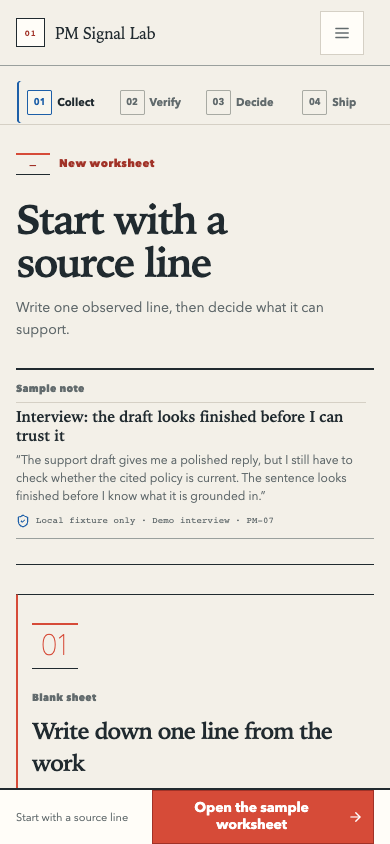

# PM Signal Lab

> Keep the source line attached to the decision it may support.

## Quick read

PM Signal Lab is a small English-first, local-first worksheet for putting a
product signal beside its source, checking what the claim can support, and
naming the smallest next test.

The sample is a fictional support-draft review. It shows PM judgment without
turning the working surface into a model chat wrapper.

**Try it:** [hosted demo](https://asdc163.github.io/pm-signal-lab/)

**Portable skill:** [`pm-source-to-test` in PR #43](https://github.com/asdc163/pm-signal-lab/pull/43)
is the small, tool-free PM skill that turns messy notes into a source ledger,
candidate claims, limitations, and one smallest test. It is still under review
and is not in the default branch yet.

**Current state:** PR #44 is Draft. The current candidate is locally verified;
the canonical Pages URL still serves the previous bundle. The pilot is on hold
until the hosted release gate passes.

<details>
<summary>Open the release evidence trail</summary>

- [Current-head release preflight](./docs/product/pm-signal-lab/124-current-head-release-preflight-2026-08-16.md)
- [First-run choice clarity contract](./docs/product/pm-signal-lab/122-first-run-choice-clarity-contract-2026-08-16.md)
- [First-run choice clarity local QA](./docs/product/pm-signal-lab/123-first-run-choice-clarity-local-qa-2026-08-16.md)
- [First-run source-truth local QA](./docs/product/pm-signal-lab/117-first-run-source-truth-local-qa-2026-08-16.md)
- [Keyboard-only workflow local QA](./docs/product/pm-signal-lab/115-keyboard-only-workflow-local-qa-2026-08-16.md)
- [Machine-readable QA evidence manifest](./docs/product/pm-signal-lab/qa-evidence-manifest-2026-08-16.json)
- [Historical product and QA audit trail](./docs/product/pm-signal-lab/)

</details>

**Hosted demo boundary:** The [demo](https://asdc163.github.io/pm-signal-lab/)
is English-first, local-first, and deterministic. It has no login, database,
external model provider, telemetry, or automatic GitHub submission. The
canonical URL remains on the previous bundle until PR #44 is approved and
deployed.

> **Evidence:** Local checks pass. Hosted candidate behavior, Chrome Extension
> control, native screen-reader speech, non-owner sessions, adoption, and GitHub
> growth remain unverified.

**Public pilot:** The five-person international PM trial is on hold until the
hosted release gate passes. The [session kit](./docs/operations/pm-session-kit.md)
and [pilot issue #4](https://github.com/asdc163/pm-signal-lab/issues/4) are
prepared materials, not adoption evidence.

**Design trail:** [DESIGN.md](./DESIGN.md) records the visual DNA and layout
rules. The release and QA links are grouped above so the first read stays short.

This is an AI product manager portfolio project by [John Wu](https://github.com/asdc163).
It demonstrates evidence handling, uncertainty, experiment design, and an
honest handoff. The deterministic fixture is labelled as a fixture; it does not
stand in for model quality or user adoption.

## Five-minute trial

No login or API key is required.

1. Open the [hosted demo](https://asdc163.github.io/pm-signal-lab/) and select `Open the sample worksheet`.
2. Expand one row with `View source`. Check the source number, original text, date, and limitation.
3. Select `Start review`. Accept one claim, edit one, or keep one as a hypothesis.
4. Open `Decide`, choose a direction, and select `Draft smallest experiment`.
5. Review the primary metric, guardrail, smallest test, decision rule, and `Not covered` section.
6. Export, copy, or download the Markdown decision brief.
7. In `Ship`, open `Help decide what to fix next` after the brief. Three lines are enough: what you expected, where you hesitated, and one change that would make you try again. Add trust or recovery detail if it matters.
8. Inspect the generated field note before opening the public GitHub feedback page. Submission is always manual.

The product path is:

`Collect → Verify → Decide → Ship`

The point is to make the source, claim, limitation, and next action visible in one path. It is not to make you trust an opaque answer.



This is the current candidate's first-run source-proof snapshot captured locally
on 2026-08-16 at 390×844. The [focused local QA report](./docs/product/pm-signal-lab/123-first-run-choice-clarity-local-qa-2026-08-16.md)
records the source title, bounded excerpt, source identity, local-only boundary,
first-screen sample/own-signal choice, duplicate-quote removal, keyboard
workflow, responsive geometry, and the remaining Chrome Extension,
hosted-release, native AT, participant, and growth boundaries. [First-run desktop](./docs/product/pm-signal-lab/assets/qa/first-run-source-truth-1440-2026-08-16.png),
[loaded desktop](./docs/product/pm-signal-lab/assets/qa/less-ai-margin-note-evidence-state-loaded-1440-2026-08-16.png),
[loaded tablet](./docs/product/pm-signal-lab/assets/qa/less-ai-margin-note-evidence-state-loaded-1024-2026-08-16.png),
and [loaded mobile](./docs/product/pm-signal-lab/assets/qa/less-ai-margin-note-evidence-state-loaded-390-2026-08-16.png)
screenshots are also available.

## What is in the current candidate

The following describes the current source candidate. It should not be read
as proof that the canonical Pages URL has already been promoted to this exact
bundle.

- A deterministic, fictional AI-assisted support-draft sample pack containing interview, support, product-observation, and evaluation-review signals.
- Source rows with stable numbers, source identity, dates, original text, and an expandable source view.
- Candidate claims that keep their source mapping and limitation visible.
- Human review actions: accept a claim, edit it, keep it as a hypothesis, or mark missing evidence.
- An editable experiment brief with a primary metric, guardrail, smallest test, decision rule, owner, and readiness state.
- A Markdown decision brief with evidence, known limits, next action, and a `Not covered` section.
- A local session receipt and a privacy-gated session feedback field note that never includes raw evidence.
- A source-truth boundary that keeps `Your source sheet` / `your source notes · local sheet` separate from the fictional sample's support-draft labels.
- Responsive desktop, tablet, mobile, keyboard-only workflow, loading, empty, error, and recovery states.

All session content stays on the current page and resets on refresh. The hosted demo has no login, database, external AI provider, API-key flow, GitHub mutation, MCP action, telemetry, or automatic issue submission. Copy or download anything you want to keep before leaving or refreshing.

## Why this product exists

AI can make a polished summary quickly. The harder PM questions remain:

- Which line came from which source?
- What is observation, what is a claim, and what is still a hypothesis?
- Which source, freshness, or evaluation gap changes the decision?
- What is the smallest test that could change what we do next?

PM Signal Lab treats those questions as a product workflow. The interface keeps the observed line beside the working claim, keeps human review visible, and keeps missing evidence from becoming a confident-looking conclusion.

The product direction was informed by a reference study of 1,042 public GitHub repositories, including metadata, README structure, and 20 near-neighbor case studies. Read the [English research summary](./docs/research/github-reference-research-2026-08-14.en.md) and the [original working note](./docs/research/github-reference-research-2026-08-14.md). This is a reference corpus, not adoption evidence or a success guarantee.

## Quickstart

Requirements: Node.js 20.19+ and npm.

```bash
npm install
npm run dev
```

Open the Vite URL and follow `Collect → Verify → Decide → Ship`.

Before submitting a change, run the local gate:

```bash
npm test
npm run lint
npm run build
npm run verify:hosted
npm run verify:source-truth
npm run verify:keyboard
```

## Product and engineering shape

The core domain path is:

`Evidence → Claim → ExperimentBrief → DecisionMemo`

The UI and domain engine are separate so a future provider adapter can be evaluated without putting API keys, model drift, or external side effects into the first release.

- [`src/App.tsx`](./src/App.tsx) composes the workflow, states, accessible controls, and local interactions.
- [`src/domain/synthesis.ts`](./src/domain/synthesis.ts) builds deterministic candidate claims and experiment drafts.
- [`src/domain/export.ts`](./src/domain/export.ts) enforces the decision-brief readiness gate and Markdown export.
- [`src/domain/feedback.ts`](./src/domain/feedback.ts) prepares a privacy-gated session field note.
- [`src/domain/fixture.ts`](./src/domain/fixture.ts) holds the repeatable signal-review sample pack.
- [`src/styles.css`](./src/styles.css) defines the quiet workpaper, neutral shell, trust-blue provenance, action-red review cue, ruled source rows, index strip, and responsive layout.
- [`.github/workflows/deploy-pages.yml`](./.github/workflows/deploy-pages.yml) builds and deploys the hosted demo from `main`.
- [`.github/workflows/hosted-demo-smoke.yml`](./.github/workflows/hosted-demo-smoke.yml) checks the canonical hosted demo after deployment, daily, and on manual dispatch.
- [`scripts/verify-hosted-demo.mjs`](./scripts/verify-hosted-demo.mjs) performs the read-only HTTPS, asset, and current-copy check used by the hosted smoke workflow.
- [`scripts/verify-session-boundary.py`](./scripts/verify-session-boundary.py) replays the local stale-state and duplicate-loading browser oracle and captures focused mobile evidence.
- [`scripts/verify-source-sheet-truth.py`](./scripts/verify-source-sheet-truth.py) checks the manual/sample visible-copy boundary at mobile and desktop widths, including the owner confirmation field.
- [`scripts/verify-keyboard-flow.py`](./scripts/verify-keyboard-flow.py) replays the blank-form recovery and pointer-free Collect → Verify → Decide → Ship path at mobile and desktop widths.
- [`.github/workflows/weekly-growth-pulse.yml`](./.github/workflows/weekly-growth-pulse.yml) records read-only public repository signals as a reviewable artifact; it does not automate social activity.
- [`DESIGN.md`](./DESIGN.md) records the visual DNA, tokens, states, and layout rules.

The current English-first product contract is [`34-english-first-product-messaging-contract-2026-08-15.md`](./docs/product/pm-signal-lab/34-english-first-product-messaging-contract-2026-08-15.md). The latest mobile composition contract is [`83-mobile-source-first-reading-contract-2026-08-16.md`](./docs/product/pm-signal-lab/83-mobile-source-first-reading-contract-2026-08-16.md), followed by the [`82-quiet-workpaper-second-polish-contract-2026-08-16.md`](./docs/product/pm-signal-lab/82-quiet-workpaper-second-polish-contract-2026-08-16.md). The editorial case-sheet contract and local evidence remain available in [`78-editorial-case-sheet-visual-reframe-contract-2026-08-15.md`](./docs/product/pm-signal-lab/78-editorial-case-sheet-visual-reframe-contract-2026-08-15.md) and [`79-editorial-case-sheet-local-qa-2026-08-15.md`](./docs/product/pm-signal-lab/79-editorial-case-sheet-local-qa-2026-08-15.md). Historical audits remain available as a release trail.

## English-first public surface

The latest English-first visual and behavior evidence is kept in the [mobile action context local QA report](./docs/product/pm-signal-lab/95-mobile-action-context-local-qa-2026-08-16.md) and [craft contract](./docs/product/pm-signal-lab/94-mobile-action-context-and-craft-pass-contract-2026-08-16.md). Earlier audits remain a historical release trail; the [formal hosted release contract](./docs/operations/hosted-demo-release-contract-2026-08-15.md) records the separate Pages gate.

The intended public surface is `en-US`: UI copy, sample data, generated Markdown, accessible names, page metadata, README, trial kit, and public feedback handoff. The current candidate has local evidence; the hosted URL remains a prior preview until the release gate passes.

This release intentionally does not add a locale selector or runtime translation framework. The next localization decision should follow evidence from international PM sessions, not an assumption that more language options automatically improve the first-run job.

## What this does not claim

- This is not a production AI-quality benchmark.
- The hosted demo has no external model provider; its support-draft worksheet is a deterministic fixture, so it does not prove model quality.
- No real-user task sessions, retention, conversion, adoption, or GitHub growth outcome are claimed by this repository.
- GitHub stars, forks, traffic, and issue activity are external results; a polished hosted demo is not evidence of any target number.
- The `4 of 5` threshold inside the experiment brief is a proposed decision rule, not completed research.

## Try it and report one observation

If you are a PM, founder, product designer, or product engineer, use the [five-minute session kit](./docs/operations/pm-session-kit.md) without a maintainer walkthrough. The most useful report is one concrete hesitation, trust or doubt signal, recovery moment, and one change you would make.

The public feedback issue is [#4](https://github.com/asdc163/pm-signal-lab/issues/4) and is pinned in the repository. The copy-ready handoff is [`public-pilot-issue-body.md`](./docs/operations/public-pilot-issue-body.md). Review every line before submitting. Do not include customer names, private tickets, API keys, tokens, confidential roadmap material, or raw sensitive evidence.

Stars are optional. Specific, reproducible feedback is more useful than a number that cannot explain what happened.

## Promotion gates

The next product decision is gated by evidence, not visual polish:

1. Collect at least five target-user task sessions before evaluating an external model or provider adapter.
2. Evaluate a portable JSON schema only if several external workflows ask to bring their own evidence pack.
3. Consider read-only GitHub or MCP integration only after source provenance and approval behavior are stable.
4. Keep login, telemetry, and external mutation out of the hosted demo until usability evidence and explicit authorization support that scope.

## License

No license has been declared yet. Unless written permission says otherwise, treat this repository as a readable public demo and do not republish it or include its code in a commercial product.
